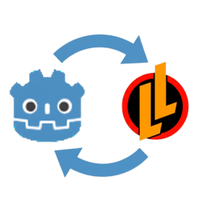

# Legends of Learning SDK Integration Plugin for Godot



## Overview

The **Legends of Learning SDK Integration Plugin for Godot** is an essential Godot addon designed to simplify communication between your game and the Legends of Learning (LoL) platform environment.

It automatically provides a global **Singleton** called **`LoLApi`** which handles all low-level `JavaScriptBridge` messaging, allowing you to focus on game development.


-----

## 🚀 Installation

1.  **Install Plugin:** Download legends-of-learning-sdk-5.4-integration-plugin-for-godot-4.4-vMAJOR.MINOR.PATCH.zip from [GitHub Releases](https://github.com/TheDigitalSpell/legends-of-learning-sdk-integration-plugin-for-godot/releases) or Godot Asset Library. Unzip and copy the `addons/lolapi` folder into the `addons/` directory of your Godot 4 project.
2.  **Enable Plugin:** Go to **Project \> Project Settings \> Plugins** and check the status of the **Legends of Learning SDK Integration Plugin for Godot** is set to **Enable**.
3.  **Export Feature:** For export targeting the LoL platform, go to **Project \> Export \>** and create a new export preset (e.g. **HTML5 - LoLApi**) and add `LoLApi` to the feature list.
4.  **Translation Requirement (Crucial) 🌐:** The plugin relies on the **`TranslationsLoader`** utility class to manage in-game language changes requested by the LoL platform. This utility interacts with Godot's **`TranslationServer`**. You **must** have a primary translation file named **`translations.json`** located in the **root** of your project (`res://translations.json`). This file is required to properly initialize Godot's translation system before the SDK sends a language change.
5. **Optimization for LoL Platform (Mandatory) 📦:** To publish games on LoL using Godot 4, you **must reduce the final build size**. LoL requires a stripped-down HTML export template to meet their size requirements.
      * **Optimization Guide:** [Optimizing Godot Builds for HTML5/LoL](https://thedigitalspell.com/optimizing-godot-builds/)
      * **Optimization Tool:** [godot-lol-web-build-template-builder](https://github.com/ChocolatePinecone/godot-lol-web-build-template-builder)

## 🔌 Core Usage

The wrapper uses the standard Godot **Signals** and **Methods** pattern.

  * **Signals:** For **incoming** messages from the LoL SDK to your game (e.g., "Pause," "Load Data").
  * **Methods:** For **outgoing** messages from your game to LoL SDK (e.g., "Save Data," "Complete Game").

The **`LoLApi`** Singleton is available globally.

### Step 1: Initialize Communication

In your main game script, use the `OS.has_feature()` check to ensure the LoLApi is only initialized when running in the required web environment.

```gdscript
func _ready():
    # ... your game initialization logic ...

    # Godot 4: Check for the HTML5 LoLApi feature
    if OS.has_feature("LoLApi"): 
        # Start the communication handshake
        _init_LoL()
    else:
        print("Running in local mode. LoL SDK features disabled.")
        # Run your local load/initialization logic here

func _on_savedata_loaded():
    # ... your game continue here ...
```

### Step 2: Respond and Send the Ready Signal

The `_init_LoL` method is the key starting point. Use its callback to request save data, and finally, notify the SDK that your game is fully ready.

```gdscript
#region LoL
func _init_LoL():
	LolApi.init_message_received.connect(_on_LoL_init_message_received)
	LolApi.start_message_received.connect(_on_LoL_start_message_received)
	LolApi.translation_message_received.connect(_on_LoL_translation_message_received)
	LolApi.load_state_message_received.connect(_on_LoL_load_state_message_received)	  LolApi.save_state_result_message_received.connect(_on_LoL_save_state_result_message_received)
	# ... See demo script for more examples
	
	LolApi.send_init_message()

func _on_LoL_init_message_received(_payload: Dictionary):
	LolApi.send_start_message()

func _on_LoL_start_message_received(payload: Dictionary):
	# '{"languageCode":"en","awkAutoSpeak":false,"awkMusicOn":false,"awkSfxOn":false}'}
	LolApi.send_saves_request_message()

func _on_LoL_translation_message_received(payload: Dictionary):
	TranslationsLoader.set_locale(payload.language)
	# ... Refresh language here ...
	
func _on_LoL_load_state_message_received(payload: Dictionary):
	if not payload.is_empty() and payload.has("data"):
		# ... load_game with payload.data ...
		if payload.has("currentProgress"):
			# ... you can save currentProgress with payload.currentProgress to increase it ...
	else:
		# ... load_game with default data ...
	await get_tree().process_frame
	# Force save in next frame
	# ... save_game ...
#endregion
```

-----

## 📊 Essential Outgoing Methods

Use these methods on the global `LoLApi` Singleton to communicate key game events back to the LoL SDK:

| Method | Purpose |
| :--- | :--- |
| `LoLApi.send_save_state_message(current_progress, max_progress, data)` | Saves the current state. `data` is a Dictionary that is converted to JSON. |
| `LoLApi.send_progress_and_score_message(current_progress, max_progress, score)` | Sends the player's progress and score for tracking. |
| `LoLApi.send_complete_message()` | Notifies the platform that the game has finished. |
| `LoLApi.send_text_to_speech_message(text, code)` | Sends text to be read aloud by the platform's Text-to-Speech service. |
| `LoLApi.send_pause_message()` | Tells the platform that the game is pausing (less common, usually managed by the platform). |

## 🙏 Acknowledgements and Origin

This Godot 4 plugin is based on and continues the development of the original Godot 3 plugin.

We are highly grateful to **ChocolatePinecone** for their foundational work and have their consent to continue and maintain this plugin for Godot 4.

**Original Godot 3 Plugin:** [https://bitbucket.org/chocolatepinecone/godot-lol-libs](https://bitbucket.org/chocolatepinecone/godot-lol-libs)